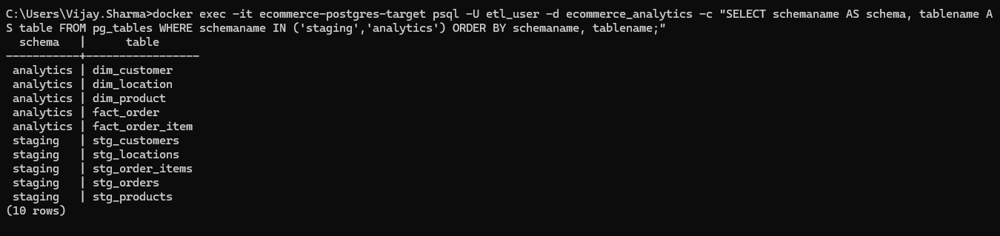
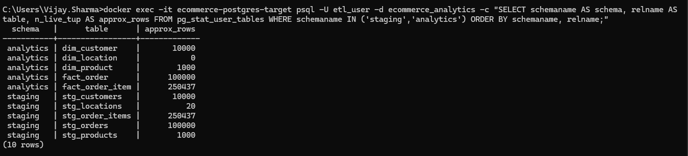
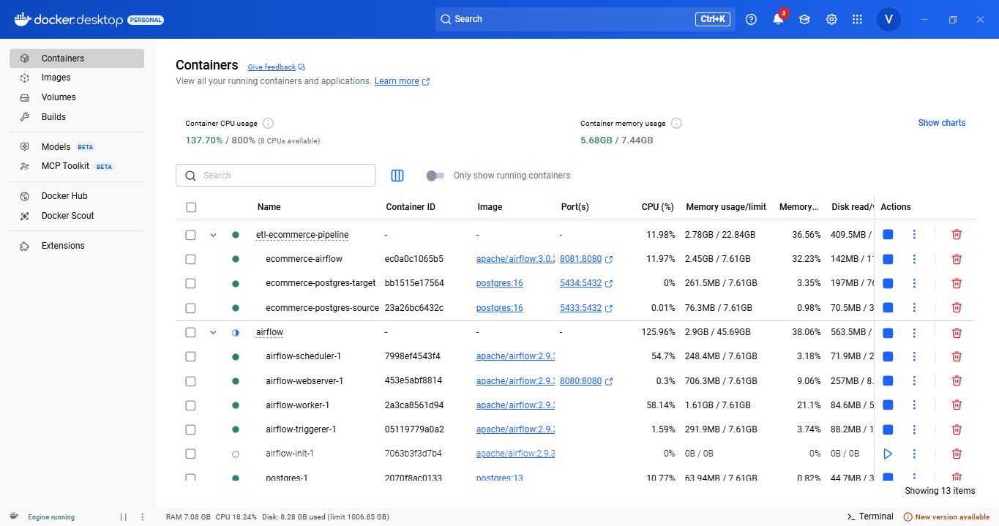
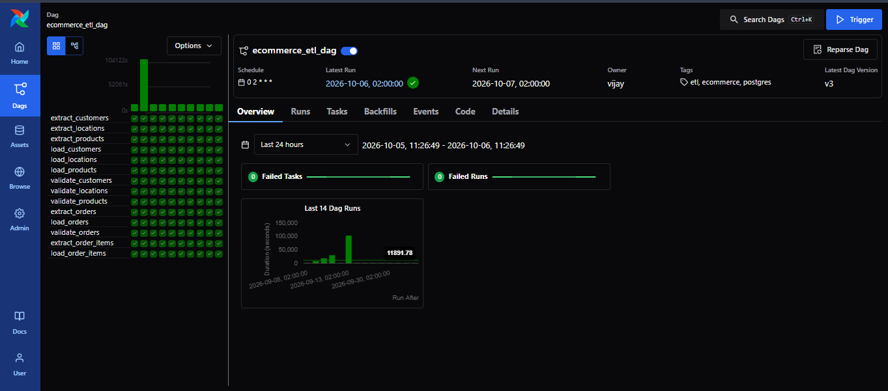
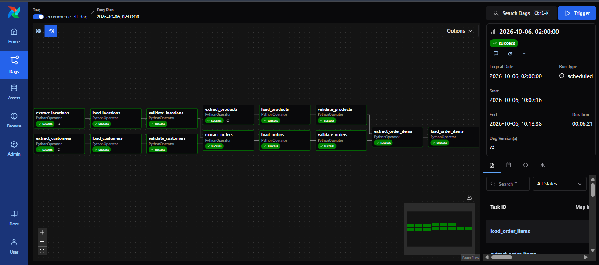
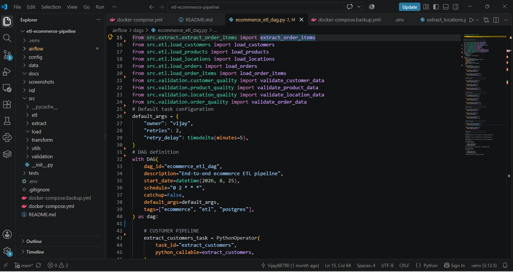

# Ecommerce ETL Pipeline

An end-to-end ecommerce data engineering project built using **Python, PostgreSQL, Docker, and Apache Airflow**.

This project demonstrates a complete ETL workflow from source PostgreSQL databases into an analytics warehouse, including **staging, dimensional modeling, fact tables, data-quality validation, orchestration, retries, and scheduled execution**.

---

## Architecture

```text
Source PostgreSQL
       |
       v
   Python ETL
       |
       v
  Staging Layer
       |
       v
Analytics Warehouse
       |
       v
Data Quality Validation
       ^
       |
 Apache Airflow
```

---

## Tech Stack

- Python
- PostgreSQL 16
- Apache Airflow 3.0.2
- Docker
- Docker Compose
- psycopg2
- SQL
- Git / GitHub

---

## Project Structure

```text
etl-ecommerce-pipeline/
|
├── airflow/
│   └── dags/
│       └── ecommerce_etl_dag.py
|
├── sql/
│   └── load_dim_customer.sql
|
├── src/
│   ├── etl/
│   ├── extract/
│   ├── validation/
│   └── utils/
|
├── screenshots/
│   ├── airflow_dag_overview.png
│   ├── airflow_successful_run.png
│   ├── docker_etl_infrastructure.png
│   ├── etl_airflow_dag_code.png
│   ├── postgresql_tables.png
│   └── postgresql_warehouse_counts.png
|
├── docker-compose.yml
├── .gitignore
├── README.md
└── .env
```

---

# ETL Pipeline

The pipeline processes five major entities:

## Customers

```text
Source
   |
Extract
   |
staging.stg_customers
   |
Load
   |
analytics.dim_customer
   |
Validation
```

Validated count: **10,000 customers**

---

## Products

```text
Source
   |
Extract
   |
staging.stg_products
   |
Load
   |
analytics.dim_product
   |
Validation
```

Validated count: **1,000 products**

---

## Locations

```text
Source
   |
Extract
   |
staging.stg_locations
   |
Load
   |
analytics.dim_location
   |
Validation
```

Validated count: **20 locations**

---

## Orders

Orders depend on the customer and location dimensions.

```text
Customer Validation ──┐
                      ├──> Extract Orders
Location Validation ──┘
                           |
                           v
                      Load Orders
                           |
                           v
                   Validate Orders
```

Validated count: **100,000 orders**

---

## Order Items

Order items depend on products and orders.

```text
Product Validation ──┐
                     ├──> Extract Order Items
Order Validation ────┘
                           |
                           v
                    Load Order Items
```

Validated count: **250,437 order items**

---

# Data Warehouse

The target PostgreSQL database contains two main layers.

## Staging Layer

The staging layer stores extracted source data before loading it into the analytics layer.

```text
staging
├── stg_customers
├── stg_products
├── stg_locations
├── stg_orders
└── stg_order_items
```

## Analytics Layer

The analytics layer follows a dimensional warehouse structure.

### Dimensions

```text
analytics.dim_customer
analytics.dim_product
analytics.dim_location
```

### Facts

```text
analytics.fact_order
analytics.fact_order_item
```

The warehouse uses **surrogate keys for dimensions** while maintaining source business keys for traceability.

---

## Warehouse Tables

The following screenshot shows the staging and analytics tables created in PostgreSQL.



---

# Airflow

The complete ETL process is orchestrated using **Apache Airflow**.

## DAG

```text
ecommerce_etl_dag
```

The DAG manages:

- Extraction
- Staging loads
- Dimension loads
- Fact loads
- Data-quality validation
- Task dependencies
- Retries
- Scheduled execution

---

## Task Flow

```text
Customers
Extract → Load → Validate
                    |
Locations            |
Extract → Load → Validate
                    |
                    v
              Extract Orders
                    |
                Load Orders
                    |
              Validate Orders
                    |
                    v
           Extract Order Items
                    |
             Load Order Items
```

---

# Scheduling

Production schedule:

```text
0 2 * * *
```

The pipeline runs daily at **2:00 AM**.

Timezone:

```text
Asia/Kolkata
```

During development, automatic scheduling was tested using:

```text
*/10 * * * *
```

The 10-minute schedule was used to verify automatic Airflow scheduler execution before returning to the final daily schedule.

---

# Retry Handling

The pipeline supports Airflow task retries for transient failures.

Default configuration:

```text
Retries: 2
Retry Delay: 5 minutes
```

This helps prevent temporary errors from immediately failing the entire workflow.

---

# Data Quality

Data-quality validation compares source, staging, and analytics record counts.

```text
Source Count
     |
     v
Staging Count
     |
     v
Analytics Count
     |
     v
  PASS / FAIL
```

## Validated Warehouse Counts

| Table | Row Count |
|---|---:|
| `dim_customer` | 10,000 |
| `dim_product` | 1,000 |
| `dim_location` | 20 |
| `fact_order` | 100,000 |
| `fact_order_item` | 250,437 |

---

## PostgreSQL Warehouse Validation

The following screenshot shows the warehouse tables and their staging/analytics structure.


The following screenshot shows the validated warehouse record counts.



---

# Docker Environment

The complete local environment runs using **Docker Compose**.

## Services

```text
postgres-source
postgres-target
airflow
```

## Ports

```text
Source PostgreSQL → 5433
Target PostgreSQL → 5434
Airflow           → 8081
```

## Start Environment

```bash
docker compose up -d
```

## Check Containers

```bash
docker compose ps
```

## Open Airflow

```text
http://localhost:8081
```

---

## Docker Infrastructure



---

# Environment Variables

Database credentials are stored locally in:

```text
.env
```

The `.env` file is excluded from Git using `.gitignore`.

Example:

```text
SOURCE_DB_HOST=
SOURCE_DB_PORT=
SOURCE_DB_NAME=
SOURCE_DB_USER=
SOURCE_DB_PASSWORD=

TARGET_DB_HOST=
TARGET_DB_PORT=
TARGET_DB_NAME=
TARGET_DB_USER=
TARGET_DB_PASSWORD=
```

**Actual credentials should never be committed to GitHub.**

---

# Manual ETL Execution

Individual pipeline components can also be executed manually.

## Extract Customers

```bash
python -m src.extract.extract_customers
```

## Load Customers

```bash
python -m src.etl.load_customers
```

## Validate Customers

```bash
python -m src.validation.customer_quality
```

The complete pipeline is normally executed through Airflow.

---

# Airflow Execution

## DAG Overview

The Airflow DAG contains the complete extraction, loading, and validation workflow.



---

## Successful Pipeline Run

The complete pipeline successfully executed with all tasks completed successfully.



---

## Airflow DAG Code

The DAG implementation is responsible for defining tasks, dependencies, retries, and scheduling.



---

# Key Learning Areas

This project demonstrates practical experience with:

- ETL pipeline development
- Python data extraction
- PostgreSQL
- SQL
- Staging architecture
- Dimensional modeling
- Fact and dimension tables
- Surrogate keys
- Upsert processing
- Data-quality validation
- Airflow DAG development
- Airflow task dependencies
- Airflow retries
- Airflow scheduling
- Docker containerization
- Environment configuration
- Git version control

---

# Future Improvements

Potential future improvements include:

- AWS deployment
- External Airflow metadata database
- Centralized monitoring
- Failure notifications
- Incremental extraction using timestamps
- Additional data-quality checks
- Unit and integration testing
- CI/CD pipeline
- Cloud secret management
- Warehouse performance optimization
```
